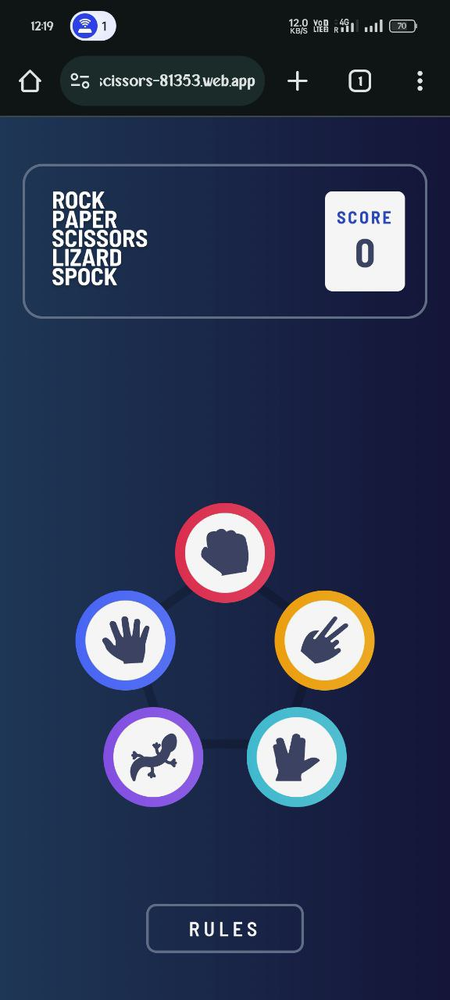

# Frontend Mentor - Rock, Paper, Scissors

## Welcome! 👋

This is a solution to the [Rock, Paper, Scissors challenge on Frontend Mentor](https://www.frontendmentor.io/challenges/rock-paper-scissors-game-pTgwgvgH). Frontend Mentor challenges help you improve your coding skills by building realistic projects.

## Table of contents

- [Overview](#overview)
  - [The challenge](#the-challenge)
  - [Screenshot](#screenshot)
  - [Links](#links)
- [My process](#my-process)
  - [Built with](#built-with)
- [Author](#author)

## Overview

### The challenge

Users should be able to:

- View the optimal layout for the game depending on their device's screen size
- Play Rock, Paper, Scissors against the computer
- **Bonus**: Play Rock, Paper, Scissors, Lizard, Spock against the computer _(optional)_

### Screenshot

#### Desktop Screenshot

#### Mobile Screenshot

### Links

- [Solution URL](https://github.com/Subashkumar-S/Rock-Paper-Scissors)
- [Live Site URL](https://rock-paper-scissors-81353.web.app/)

## My process

### Built with

- Semantic HTML5 markup
- Flexbox
- CSS Grid
- [React](https://reactjs.org/) - JS library
- [SCSS](https://sass-lang.com/)

## Author

- Website - [Subashkumar S](https://subashkumar-s.web.app)
- Frontend Mentor - [@Subashkumar-S](https://www.frontendmentor.io/profile/Subashkumar-S)
- LinkedIn - [subashkumar-s](https://www.linkedin.com/in/subashkumar-s)